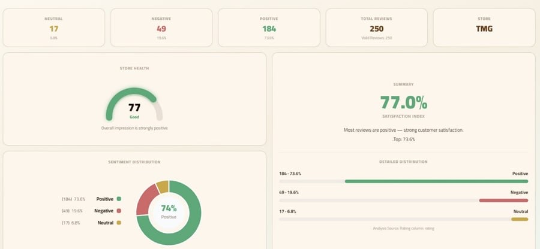

# Arabic Sentiment Analysis

An AI-powered web application for analyzing Arabic e-commerce reviews and classifying them into Positive, Negative, and Neutral sentiments using MARBERT and Natural Language Processing (NLP) techniques. The system helps businesses understand customer feedback, measure satisfaction, and make data-driven decisions through interactive visualizations.

## Landing Page

The landing page introduces the platform and highlights its key benefits, including customer satisfaction analysis, performance improvement, and smart decision-making.

## System Interface

Users can select a store and generate sentiment analysis results through a simple and user-friendly interface.

## Dashboard

The dashboard provides key insights, including sentiment distribution, customer satisfaction indicators, review statistics, and visual analytics to support business decisions.

## Features

- Arabic text preprocessing
- Sentiment classification using MARBERT
- Interactive Streamlit dashboard
- Real-time visual analytics
- Positive, Negative, and Neutral classification

## Technologies

- Python
- MARBERT
- Transformers
- Pandas
- Streamlit
- Matplotlib
